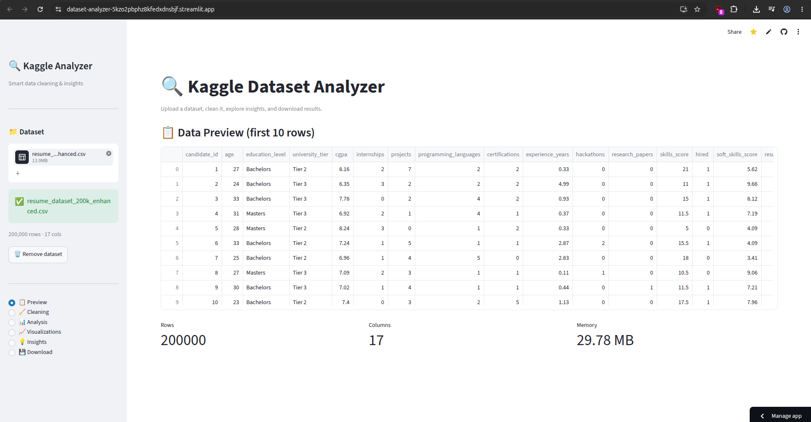
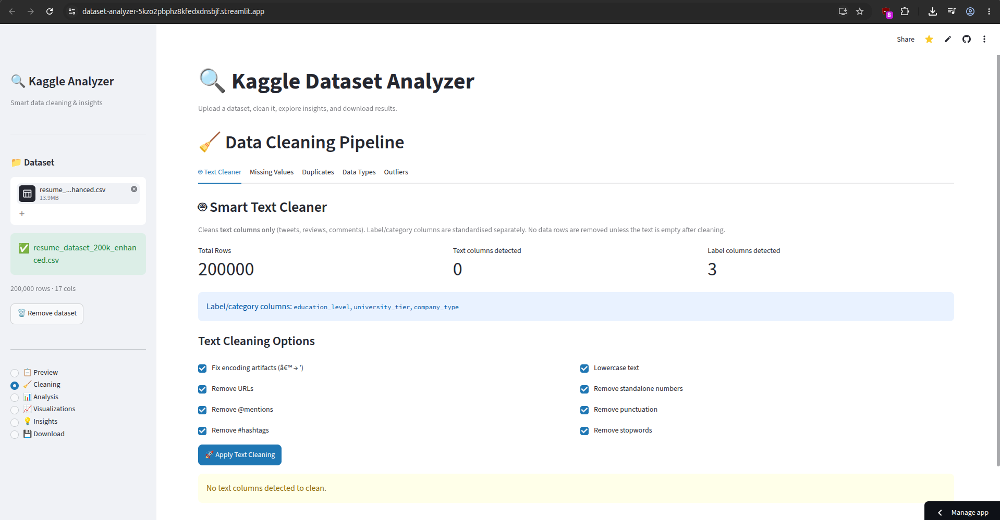
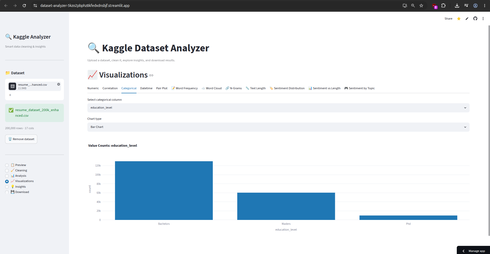

<div align="center">


<br/>

[](https://www.python.org/)
[](https://streamlit.io/)
[](https://pandas.pydata.org/)
[](https://plotly.com/)
[](LICENSE)

<br/>

> **A powerful, all-in-one Streamlit dashboard** to upload, auto-clean, analyze, visualize, and download any CSV/Excel dataset — built for data scientists, analysts, and learners who want instant insights without writing a single line of code.

<br/>

### 🌐 [Live Demo →](https://dataset-analyzer-5kzo2pbphz8kfedxdnsbjf.streamlit.app/) &nbsp;&nbsp;&nbsp; ⭐ [Star this repo](https://github.com/Suhannii/Dataset-Analyzer)

> 🔗 **Live App:** [https://dataset-analyzer-5kzo2pbphz8kfedxdnsbjf.streamlit.app/](https://dataset-analyzer-5kzo2pbphz8kfedxdnsbjf.streamlit.app/)  

</div>

---

## 📌 Table of Contents

- [✨ What It Does](#-what-it-does)
- [🖼️ Screenshots](#%EF%B8%8F-screenshots)
- [🚀 Features](#-features)
- [🧱 Project Structure](#-project-structure)
- [⚙️ Tech Stack](#%EF%B8%8F-tech-stack)
- [💻 Local Setup](#-local-setup)
- [🗺️ App Navigation Guide](#%EF%B8%8F-app-navigation-guide)
- [📊 Visualizations Supported](#-visualizations-supported)
- [🤖 Auto-Cleaning Engine](#-auto-cleaning-engine)
- [💡 Auto-Insights](#-auto-insights)
- [🙋 About the Developer](#-about-the-developer)

---

## ✨ What It Does

**Dataset Analyzer** takes raw, messy CSV or Excel files and transforms them into clean, visualized, insightful data — all through a beautiful drag-and-drop web interface.

No coding. No setup overhead. Just upload and explore.

---

## 🖼️ Screenshots


| Landing Page | Cleaning Pipeline | Visualizations |
|---|---|---|
|  |  |  |
---

## 🚀 Features

### 📁 Upload
- Supports **CSV, XLSX, XLS** — up to **100 MB**
- Beautiful drag-and-drop landing zone
- Instant file re-upload from the sidebar at any time

### 🧹 Auto-Cleaning Pipeline
- **Missing value handling** — detect, fill, or drop nulls intelligently
- **Duplicate removal** — identify and remove exact duplicate rows
- **Data type optimization** — auto-cast columns to the most memory-efficient types
- **Outlier detection** — flag statistical outliers per numeric column
- **Text cleaner tab** — normalize and clean free-text columns
- Shows a **Before vs After** diff of every cleaning action

### 📊 Data Analysis
- Complete **summary statistics** (mean, std, min, max, quartiles)
- **Column-level deep dive** — unique values, null counts, data types
- Compact overview metrics displayed as scorecards

### 📈 12+ Interactive Visualizations
*(See full list in the Visualizations section below)*

### 💡 Auto-Generated Insights
- Automatically surfaces the most important observations about your dataset
- Highlights high-null columns, skewed distributions, strong correlations, and more

### 💾 Download
- Export cleaned data as **CSV** or **Excel (.xlsx)**
- Side-by-side **Before vs After** comparison with row/column/missing/duplicate counts

---

## 🧱 Project Structure

###Dataset-Analyzer/

│

├── app.py                    # 🚪 Main Streamlit entry point — routing + UI layout

│

├── modules/

│   ├── data_loader.py        # 📥 File validation, loading, column name fixing, auto-clean on load

│   ├── cleaner.py            # 🧹 Missing values, duplicates, dtype optimization, outlier detection

│   ├── analyzer.py           # 📊 Summary stats, column-level analysis

│   ├── visualizer.py         # 📈 All 12 chart types (numeric, categorical, text, sentiment, etc.)

│   └── insights.py           # 💡 Auto-generated dataset insights

│

├── utils/

│   ├── helpers.py            # 🛠️ CSV/Excel byte conversion for downloads

│   └── config.py             # ⚙️ App-wide configuration constants

│

├── .streamlit/

│   └── config.toml           # 🎨 Streamlit theme and layout settings

│

├── .devcontainer/            # 🐳 Dev container config for Codespaces / VS Code

├── requirements.txt          # 📦 All Python dependencies

├── .gitignore

└── README.md

---

## ⚙️ Tech Stack

| Layer | Technology |
|---|---|
| **Web Framework** | [Streamlit](https://streamlit.io/) `>=1.32` |
| **Data Manipulation** | [Pandas](https://pandas.pydata.org/) `>=2.0`, [NumPy](https://numpy.org/) `>=1.26` |
| **Visualization** | [Plotly](https://plotly.com/) `>=5.20`, [Matplotlib](https://matplotlib.org/) `>=3.8`, [Seaborn](https://seaborn.pydata.org/) `>=0.13` |
| **ML / Stats** | [Scikit-learn](https://scikit-learn.org/) `>=1.4`, [SciPy](https://scipy.org/) `>=1.12` |
| **NLP / Text** | [NLTK](https://www.nltk.org/) `>=3.8` |
| **File I/O** | [OpenPyXL](https://openpyxl.readthedocs.io/) `>=3.1`, [Chardet](https://github.com/chardet/chardet) `>=5.2` |
| **Language** | Python 3.10+ |

---

## 💻 Local Setup

### Prerequisites
- Python 3.10 or higher
- pip

### Steps

```bash
# 1. Clone the repository
git clone https://github.com/Suhannii/Dataset-Analyzer.git
cd Dataset-Analyzer

# 2. (Optional but recommended) Create a virtual environment
python -m venv venv
source venv/bin/activate        # On Windows: venv\Scripts\activate

# 3. Install dependencies
pip install -r requirements.txt

# 4. Run the app
streamlit run app.py
```

The app will open at **http://localhost:8501** in your browser.

---

## 🗺️ App Navigation Guide

| Section | What You Can Do |
|---|---|
| **📋 Preview** | See the raw data, shape, dtypes, and first/last rows |
| **🧹 Cleaning** | Run individual cleaning steps via tabs: text cleaner, missing values, duplicates, data types, outliers |
| **📊 Analysis** | Summary statistics + column-level breakdowns |
| **📈 Visualizations** | 12 chart tabs for numeric, categorical, text, NLP, and time-series data |
| **💡 Insights** | Auto-generated observations about your dataset |
| **💾 Download** | Export cleaned file as CSV or Excel with before/after comparison |

---

## 📊 Visualizations Supported

| Tab | Chart Type | Use Case |
|---|---|---|
| **Numeric** | Histograms, Box Plots | Distribution of numeric columns |
| **Correlation** | Heatmap | Relationships between numeric features |
| **Categorical** | Bar Charts, Pie Charts | Frequency of categorical values |
| **Datetime** | Time Series Line Chart | Trends over time |
| **Pair Plot** | Scatter Matrix | Multi-variable relationship overview |
| **Word Frequency** | Bar Chart | Most common words in text columns |
| **Word Cloud** | Word Cloud | Visual frequency map of text |
| **N-Grams** | Bar Chart | Common 2/3-word phrases |
| **Text Length** | Distribution Plot | Length distribution of text columns |
| **Sentiment Distribution** | Label Distribution | Class/label balance in NLP datasets |
| **Sentiment vs Length** | Scatter Plot | Correlation between sentiment and text length |
| **Sentiment by Topic** | Group Chart | Sentiment patterns across topics/categories |

---

## 🤖 Auto-Cleaning Engine

When a file is uploaded, the app immediately runs a smart cleaning pass before you even touch anything:

1. **Column name fixing** — strips spaces, lowercases, replaces special characters
2. **Missing value imputation** — fills numerics with median, categoricals with mode
3. **Duplicate row removal** — exact duplicates dropped automatically
4. **Data type optimization** — int64 → int32, object → category where applicable

A clean report is displayed in the sidebar showing how many cells were fixed and how many duplicates were removed. You can also run manual cleaning per step in the 🧹 Cleaning section for full control.

---

## 💡 Auto-Insights

After loading, click **💡 Insights** in the sidebar to get auto-generated observations like:

- Columns with high null percentages
- Features with extreme skewness
- Strong positive/negative correlations
- Low-variance or near-constant columns
- Columns with only one unique value (useless features)

---

## 🙋 About the Developer

<div align="center">

**Suhani** — CS + Data Science student, NLP researcher & full-stack builder from India 🇮🇳

[](https://github.com/Suhannii)

*Passionate about building tools that make data accessible to everyone.*

</div>

---

<div align="center">

If you found this useful, consider giving it a ⭐ on GitHub — it genuinely helps!

**Made with 🔍 + ☕ by Suhani**

</div>
